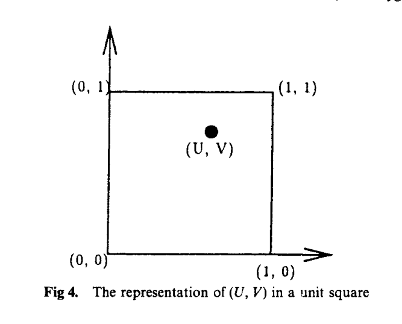
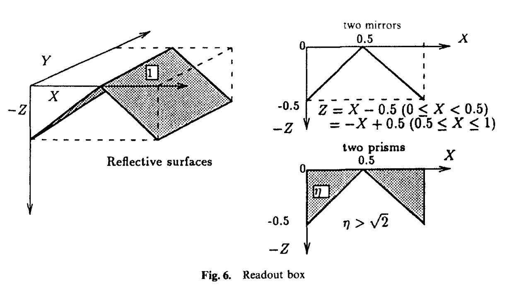
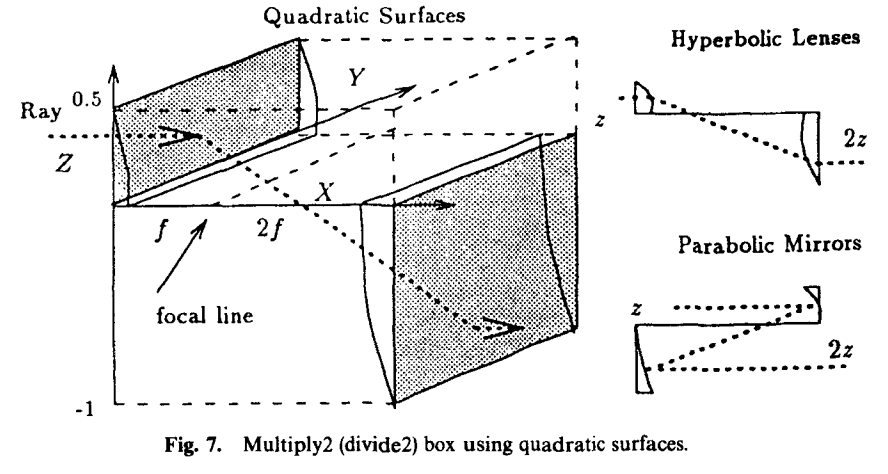
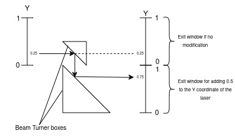
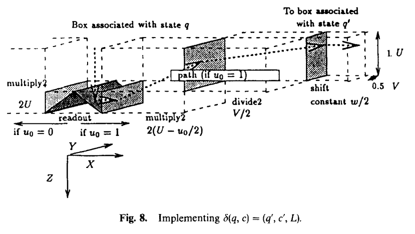
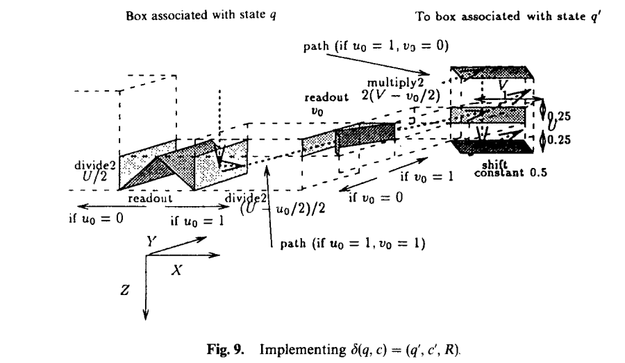

# The Ray Tracing Problem
Elliot SILBERWASSER, Emile MERIAN

* TOC
{:toc}

### Abstract

The ray tracing problem is a decision problem defined as followed : given an environment of refractive and infractive complex 3D shapes called an optical system, we want to know if a ray projected from a starting coordinate in this environment will reach a destination coordinate. This project seeks to demonstrate that The ray tracing of three-dimensional optical systems consisting of quadratic reflective or refractive objects is undecidable, even if all the objects are presented by a system of rational quadratic inequalities.

Click <a href="https://github.com/esilberw/raytracingproblem.github.io/blob/main/Assets/Report___INFO_F420___Project__2.pdf" target="_blank" style="color: blue; font-weight: bold;">here</a> to view a PDF report documenting all the details of the project.

## Introduction

To prove the undecidability of the ray tracing problem, we will focus on another known undecidable problem, the Membership problem. By reducing all instances of the membership problem into instances of the ray tracing problem, we will prove that not all instances of the ray tracing problem can be decided, and as such is undecidable.

## Preliminaries

We will now give some basic terminologies and definitions that will be useful to further our explanations. 

A reduction is a way to convert a problem into another such that : Let A, B two problems.

If the problem A can be reduced to the problem B, we can use the solution of the problem B to solve the
problem A.

This principle is very useful for showing the undecidability of a problem. To show that the problem B is
undecidable, we will show that problem A which is a problem known as undecidable can be reduced to
problem B. Therefore, the problem B is undecidable too, otherwise this contradicts the fact that problem
A is undecidable.
We can summarize the power of the reduction into two conclusions:
1. If there exists a reduction from the problem A to the problem B and we know that B is decidable,
then the problem A must be decidable
2. Inversely, if there exists a reduction from the problem A to the problem B and the problem A is known
undecidable the the problem B must me undecidable

## Problem definition

A problem can be defined as a language. Each problem instance can be encoded using a finite word w on
a finite alphabet Σ∗. Consequently, a language is an infinite set of finite words.

A decision problem is a problem where the answer is a binary yes or no. So, we decide the problem when
we can give an answer for any given input.

The question to answer for the Ray Tracing Problem is the following:
Given an optical system (namely, a finite set of reflective or refractive objects), a light ray’s
initial position and direction, and some fixed point p, does the ray eventually reach p?[1]
Deciding a decidable problem comes down to knowing whether a word w (≡ an instance of the problem)
belongs to the language L or not, where L represents the problem. It’s called the Membership Problem.
w ∈ L?
To answer at this question, we need to consider three cases:
1. w ∈ L, w is a positive instance of L ⊆ Σ∗.
2. w ∈ Σ∗ \ L, w is a negative instance ( /∈ L).
3. w is a finite words on Σ∗ which does not correspond to the encoding rules for any instances of the
problem, and therefore does not represent a valid instance of the problem considered.

### Turing Machine

A Turing Machine is a 7-tuple (Q, Σ, Γ, δ, q0, qaccept, qreject):

• Q is the finite set of control states.

• Σ is the input alphabet not containing the blank symbol of the language.

• Γ is the tape alphabet.

• δ : Q × Γ → Q × Γ is the transition function.

• q0 ∈ Q is the start state.

• qaccept ∈ Q is the accepting state.

• qreject ∈ Q is the rejecting state, where qaccept̸=qreject

A basic Turing Machine is therefore a machine with a tape which will contain the word w (the problem
instance) to read, a reading head position and control states. The machine will move state depending on the
input read by the tape head and the transition function which will determine the state to reach depending
on the input.
When a Turing Machine stops in a state qaccept, then the word w ∈ L, otherwise, the word w /∈ L. It is even
sometimes possible for the Turing Machine to loop indefinitely on a word w.
Consequently, a Turing Machine can reject a word w in two cases:
1. If the terminal state is a qreject.
2. When the Turing Machine loop on w and therefore that the Turing Machine does not stop on the
input.
In this case, the Turing Machine is called a Turing-Recognizable language. It is the equivalent of saying that
the problem (≡ the language) is undecidable because we do not know how to find an algorithm that solves
all the instances of the problem in a finite number of steps has there is a possibility of the machine infinitely
looping. Our objective will be to transform such instance of Turing-Reconizable language into an instance of Ray Tracing Problem.

### Ray Tracing

As mentioned above, an instance of the problem can be reduced to a word on a given alphabet. In our case,
the alphabet is binary and is composed of the symbols {0, 1}.
The overall vision of the problem can be seen as a starting input corresponding to an entry point of the
ray, which will then pass through the different reflective and refractive surfaces of the optical system. The
Turing Machine calculates after each passage through a surface, the exit position by the deviation caused
by the different surfaces.
In this way, the input will change on the tape depending on the modifications induced by the different
surfaces of the optical system.
Therefore, an instance of the problem is defined by two binary fractions U = 0.u0.u1.u2... and V =
0.v0.v1.v2.... These two words represent the coordinates (x, y) in decimal relative of a unit square.
We can apply two different operations on U and V.

1. LeftMove δ(q, c) = (q′, c′, L)
2. RightMove δ(q, c) = (q′, c′, R)
   
These two operations allow us to modify the encoding on the U and V words on the tape. The transformations
U′ and V′ induced by the transition functions are the following.

For the LeftMove operation, we have the following transformations[1]:

U′ = 2∞∑i=1 ui/2i+1 = 2.(U − u0/2)

V′ = c′/2 + 1/2.∞∑i=0 vi/2i+1 = c′/2 + v/2

For the RightMove operation, we have the following transformations[1]:

U′ = v0/2 + c′/4 + 1/2.∞∑i=1 ui/2i+1 = v0/2 + c′/4 + (U − u0/2)/2

V′ = 2∞∑i=1 vi/2i+1 = 2(V − v0/2)

These binary transformations will be transposed into geometry using reflective and refractive surfaces in
order to represent and simulate an optical system.

## Proposed Solution

### Basic boxes

An optical system can be represented by an intertwining of ”basic” boxes. By assembling these basic boxes
together, it forms complex boxes which will represent the two transition functions LeftMove and RightMove
mentioned above. Each complex box corresponds to one state of the Turing machine’s finite control, and
implements the transition function defined for that state.

*Each complex box has a unit square through which the ray enters and one or two unit squares from which the
ray exits. These unit squares are called the entrance windows and the exit windows, respectively. The tape is
encoded by the (X, Y) coordinates of the ray relative to the unit square windows. We organize these complex
boxes so that the whole system simulates the Turing machine. The ray enters the entrance window and exits
out of one of the two exit windows depending on which state the Turing machine may enter next. The system
then projects the ray onto the next complex box while preserving the coordinates of the ray relative to the
window, thus simulating the transition of states defined on the Turing Machine. machine [1].*

 

There are 3 types of basic boxes to be able to represent binary transformations on U and V :
**Readout boxes** - The principle of this box is to simply redirect the ray to the left or right depending
on the value of the word U given in input consequently according to the X coordinate of the first unit
square by which the ray enters. This is made possible by the 90◦ inclination of two flat mirrors or
prisms atop of the box such that if U is superior or equal to 0.5 (hence the first bit of U is 1), the ray
will be redirected by the right mirror or prism to the right of the basic box, else to the left of the basic
box by the left mirror or prism of the box. There isn’t exactly a Turing-Equivalent of this operation but it allows us to scout the values on the
tape to know how to properly handle the shifting operation and especially know if we need to handle
a bit overflow.

 

**Multiply2/Divide2 box** - The principle of this box is to redirect the ray into an exit coordinate such
that one of its coordinate value is either double or half the value of the corresponding coordinate of the
first unit square by which the ray enters. This is done by using two mirrors or lenses angled such that
the distance of the ray to the focal line as shown on the figure below either halves or double depending
on which side of the box the ray enters. By rotating the box from its horizontal axis parallel to the
focal line, we can decide whether we modify the coordinate U or V and by reversing the box on any
axis perpendicular to the focal line, we can decide to either multiply or divide that value.
This is the Turing-equivalent of shifting the bits of U or V once to either the left or right within their
allocated space on the tape, discarding bit overflow. To handle bit overflow, we will requires a beam
turner that artificially adds the overflown bit from one coordinate value to the other. For example, to
shift the tape head to the left, we need to multiply U by two and divide V by two, and adding a bit
at the beginning of V if there was an overflow on U .

 

**Beam turner box** - The simplest box among the basic boxes, the beam turner will simply change the
direction of the ray by π/2. It does so using a simple mirror or prism oriented at a π/4 angle. This
box will be used to link boxes with each other and if used in pairs, can add or subtract a constant
value to one of the coordinates of the ray.
This will allow us to simulate the Turing-equivalent of replacing the value read by the tape head with
a new value. A simple example of adding 0.5 to the coordinates of Y to the ray of light is shown below.

 

### Complex Boxes

These simple boxes will compose the complex boxes that forms the transition functions LeftMove and
RightMove that we will now present.

Implementing Left-Move The complex box allowing to represent the state q of a Turing Machine
with a Left-Move transition to a next state q’ is described as follows :

(a) The ray enters a readout box from its unit square called the entrance window of the state to check
the value of U and redirect the ray accordingly to two distinct paths of operations.

(b) The ray then enters a Multiply2 box that will divide U by two ignoring potential bit overflow.
Now we will only consider the path chosen if U >= 0.5 in which we don’t need to handle bit
overflow since we the first bit of V will be the new value c’ that replaces c.

(c) The ray finally enters a two beam turner set of boxes depending on whether the written value c’ is
0 or 1 and exits this state into the entrance window of the next state q’ such that U′ = 2(U −u0/2)
V′ = (V + c′)/2.

(d) We can implement a similar structure on the chosen path if U < 0.5.

 

Implementing Right-Move The complex box allowing to represent the state q of a Turing Machine
with a Right-Move transition to a next state q’ is described as follows :

(a) The ray enters a Readout box from its unit square called the entrance window of the state to
check the value of U and redirect the ray accordingly to two distinct paths of operations.

(b) The ray then enters a Divide2 box that will divide U by two ignoring potential bit overflow. Now
we will only consider the path chosen if U >= 0.5.

(c) The ray then enters another Readout box where it will check the value of V and redirect the
ray accordingly to two new distinct paths of operations. We will now only consider the the path
chosen if V >= 0.5.

(d) The ray finally enters a set of two beam turner boxes depending on whether the written value
c’ is 0 or 1 and exits this state into the entrance window of the next state q’ such that U ′ =
v0/2 + c′/4 + (U − u0/2)/2 and V ′ = 2(V − v0/2).

(e) We can implement a similar structure on the chosen paths if U < 0.5 and/or V < 0.5

 

### Reaching a final state

We can simulate the initial transition to the first state of the machine by projecting the ray at the position
that represent the input of the Turing Machine. In other words, we can simply aim the ray at the first
complex box of our system. To simulate the transition to a final state, we simply designate a state box to
be the final state. Therefore, if the ray doesn’t reach this final box, the input coordinates are rejected, while
if the ray does reach the final box, the input coordinates are accepted.

## Implementation

Here is a small preview environment that models what the complex boxes systems described earlier. It shows the left and right shifts operations on a simplified Turing machine as well as the system of mirrors that we must construct to simulate such operations using a ray of light in an optical system.

<iframe src="https://codesandbox.io/embed/d85szx?view=preview&expanddevtools=1"
     style="width:100%; height: 500px; border:0; border-radius: 4px; overflow:hidden;"
     title="Ray Tracing Problem Project"
     allow="accelerometer; ambient-light-sensor; camera; encrypted-media; geolocation; gyroscope; hid; microphone; midi; payment; usb; vr; xr-spatial-tracking"
     sandbox="allow-forms allow-modals allow-popups allow-presentation allow-same-origin allow-scripts"
   ></iframe>

***

## Conclusion

We have now demonstrated the capability of the optical system to operate like a Turing Machine and simulate
any reversible Turing machine where the number of complex boxes required is equal to the number of finite
states of the Machine. Therefore the problem of predicting the exact trajectory of a light ray, otherwise
called the Ray Tracing problem, can be as difficult as a problem of reaching a final state for an equivalent
reversible Turing Machine. Since the latter is undecidable, we can affirm that the Ray Tracing Problem is
also undecidable.

## References

[1] J. D. Tygar J. H. Reif and A. Yoshida. “Computability and Complexity of Ray Tracing. (English)”.
In: Discrete Comput Geom 11:265-287 (1994). doi: https://link.springer.com/content/pdf/10.
1007/bf02574009.pdf.

[2] Chad Palmer. “A Complete Web Page: Building a Turing Machine in JavaScript”. In: (2020). doi:
https://medium.com/swlh/a-complete-web-page-building-a-turing-machine-in-javascript-
d6c32d3708c4
